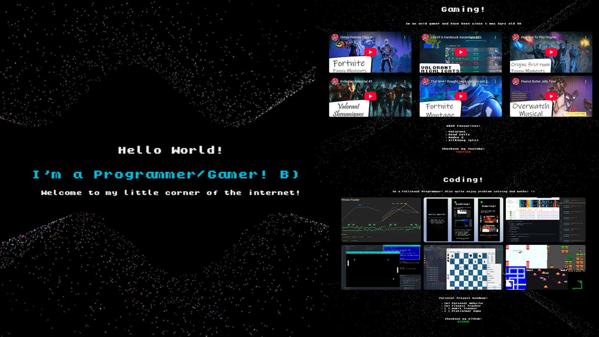

# **Personal Website**



## Motivation
The idea of this project was to make a basic personal website that I could use as a centre point for all my content:

The languages, tools and frameworks I wanted to explore with this:

- Typescript
- HTML
- NextJS
- Tailwind CSS
- Vercel
- ThreeJS

## Start Up
Run the following commands
``` shell
npm i
npm run dev
```
